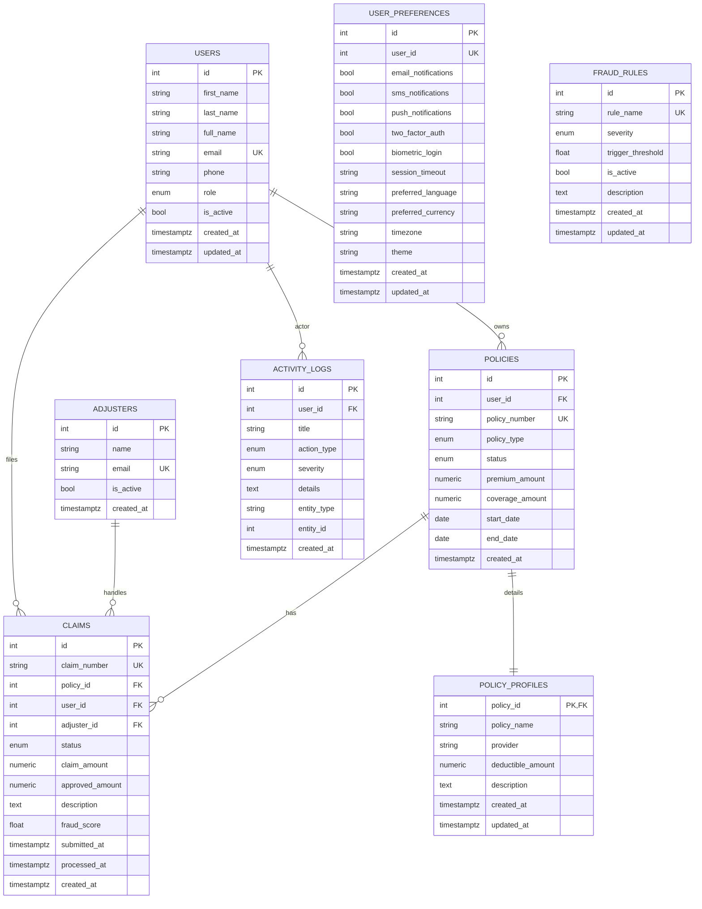

# BimaVerse Database Architecture

## 1) How PostgreSQL, Docker, and FastAPI connect

1. PostgreSQL runs in Docker (`postgres:16-alpine`) via `server/docker-compose.yml`.
2. Data persists in Docker volume `postgres_data` (so DB data survives container restarts).
3. Backend reads DB config from `server/.env`:
   - `POSTGRES_DB`
   - `POSTGRES_USER`
   - `POSTGRES_PASSWORD`
   - `POSTGRES_HOST`
   - `POSTGRES_PORT`
4. `server/src/database/core.py` builds `DATABASE_URL` from `DATABASE_URL` or `POSTGRES_*`.
5. SQLAlchemy engine/session (`engine`, `SessionLocal`) is created from that URL.
6. FastAPI uses DB sessions through dependency `get_db()`.
7. App startup checks DB connectivity with `SELECT 1`.

Current default connection string shape:

```text
postgresql+psycopg2://<POSTGRES_USER>:<POSTGRES_PASSWORD>@<POSTGRES_HOST>:<POSTGRES_PORT>/<POSTGRES_DB>
```

## 2) Schema and migration ownership

- PostgreSQL schema namespace: `public` (default).
- There is no custom schema setting in models/migrations.
- Alembic migration history is in `server/alembic/versions`.
- `alembic_version` table stores current migration version.
- `seed.py` calls `create_tables()` before seeding, so model tables can be created with `Base.metadata.create_all(...)`.

Important current behavior:
- Core tables are created by Alembic migrations.
- `policy_profiles` and `user_preferences` exist in models and are created by `create_all` if not present.
- For stricter migration discipline, these should also be represented in Alembic revisions.

## 3) ER diagram (current logical model)



## 4) Which feature uses which tables

### Admin Dashboard

- `/admin/stats`: `users`, `policies`, `claims`
- `/admin/claims-trends`: `claims`
- `/admin/revenue`: `policies` (premium side) + `claims` (approved payout side)
- `/admin/policy-distribution`: `policies`
- `/admin/top-adjusters`: `adjusters` + `claims`
- `/admin/recent-activity`: `activity_logs` + `users` (left join for actor name)

### Manage Policies

- `GET /admin/policies`: `policies` + `policy_profiles` + `users`
- `GET /admin/policies/{id}`: same join as above
- `POST /admin/policies`: insert `policies`, insert `policy_profiles`, owner selected from `users`
- `PUT /admin/policies/{id}`: update `policies`, update/create `policy_profiles`
- `DELETE /admin/policies/{id}`: delete dependent `claims` and `policy_profiles`, then delete `policies`
- `GET /admin/policies/stats`: aggregate counts from `policies`

## 5) Route prefixing (important when testing)

The backend exposes both:

- `/api/v1/...` (primary)
- `/...` (backward compatibility)

Example:
- `/api/v1/admin/policies`
- `/admin/policies`

## 6) Practical DB inspection commands

From `server/`:

```powershell
docker compose up -d
docker compose ps
docker compose exec postgres psql -U $env:POSTGRES_USER -d $env:POSTGRES_DB -c "\dt"
docker compose exec postgres psql -U $env:POSTGRES_USER -d $env:POSTGRES_DB -c "\d users"
docker compose exec postgres psql -U $env:POSTGRES_USER -d $env:POSTGRES_DB -c "select * from alembic_version;"
```

If `$env:POSTGRES_USER` and `$env:POSTGRES_DB` are not set in your shell, replace them with literal values from `server/.env`.

## 7) Setup sequence for a new machine

1. Start DB container: `docker compose up -d`
2. Run migrations: `.\venv\Scripts\alembic.exe upgrade head`
3. Seed sample data: `.\venv\Scripts\python.exe -m src.database.seed`
4. Start backend: `.\venv\Scripts\uvicorn.exe src.main:app --reload`

